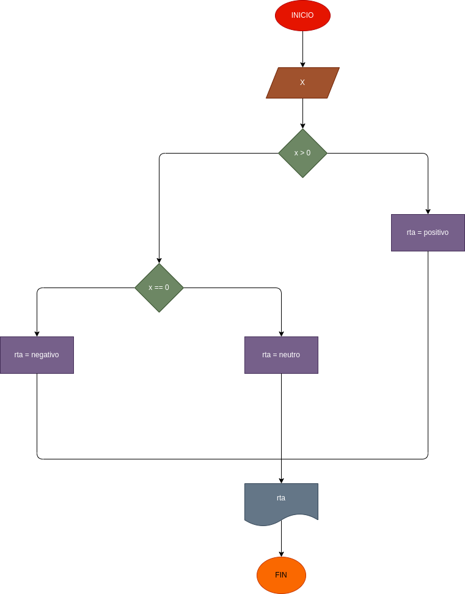

# trabajo #5

programa para verificar si un número es par o impar

# ANÁLISIS

variable de entrada (imput) X: Un numero que puede ser positivo o puede ser negativo variables de proceso y salida (processing, Storage, Output) X > 0: este sirve paera identificar si este numero es positivo o tiene otra variante X == 0: este sirve para identificar si el número es negativo o neutro

# DISEÑO

